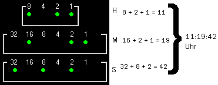

## binary clock ("coded" by me 2009)

### back then, i was a non coder...

one of my earlier programming projects from 2009
Man this is embarrassing...
I "convert" here the time, by processing hours, minutes and seconds individually and:
with 24 or with 60 if(){} statements I assign the properties (color) to the color labels...
Dude this is cumbeawkwardrsome... but I was proud at that time, that I have tinkered something like that (as a non coder)

by the way, this was my very first and until today some really "finished" project... Also such a construction site with me.

for compiling, you need a version of VB6.0 (year was 2009...)

### some images

ICON:

HELP:

### old description (in german)

Eine kleine Binaer Uhr, die Stunden/Minuten/Sekunden anzeigt, mit kleiner hilfe. Zusätzliche Einstellungen wie z.b.
Form der Punkte, Immer im vordergrund an/aus oder auch eine zusetzliche normale Digital Uhr anzeigen, sind m�glich.
Die Uhr wird oben rechts gestartet. (immer im Vordergrund ist Aktiv)
VB6.0